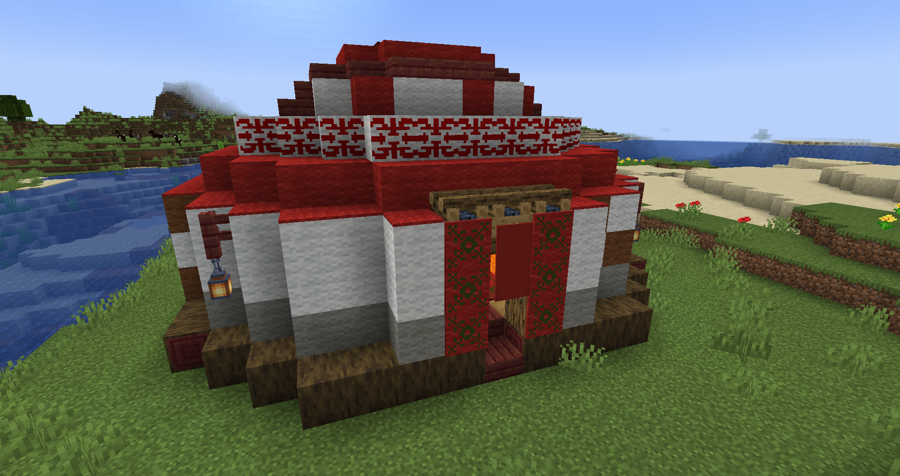
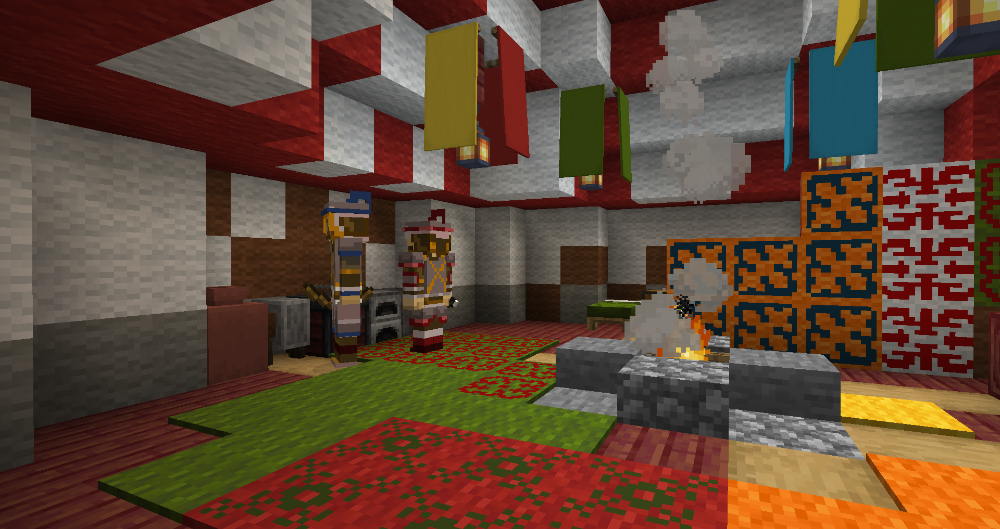
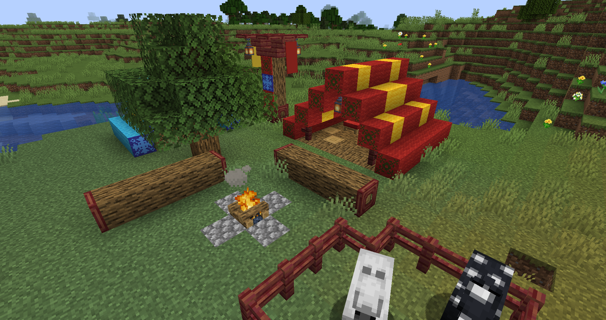
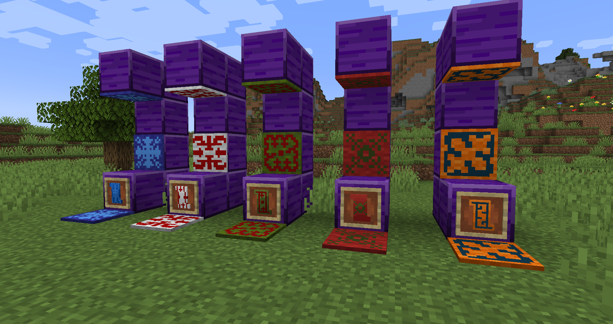

<p align="center">
  

**Nomadic** is a Minecraft Forge mod (1.21.1) created by **a1dark**.

The goal of this project is to introduce nomadic cultural elements inspired by **Central Asian and Kyrgyz traditions** into Minecraft. Instead of building static bases, this mod encourages a life of constant movement and exploration.

This is my first mod project, developed as a journey to learn Java modding and game development.

---

## Media

</p>
<p align="center">
  
  
 

</p>

---

## Features

### Mobility & Survival
* **Tengrium Campfire:** Skip the night without resetting your spawn point.
* **Traditional Sustenance:** Craft **Kymuz** and **Salted/Dried Meats** for high-saturation rations.
* **New Gear:** Iron and Tengrium armor sets grant permanent speed buffs.

### Combat & Exploration
* **Nomad Sabers:** Faster and stronger than vanilla swords. The Tengrium tier features a **Dash** ability.
* **Structures:** Discover **Yurts** and **Nomad Camps** guarded by specialized Warriors and Archers.
* **The Tengrium Spirit:** A challenging boss that guards the materials needed for end-game gear.

### Traditional Art
* **Shyrdak Carpets:** Authentic felt rugs that can be placed on **floors, walls, and ceilings**.
## Development Status
*  **Early Development:** This is first release, features are being added and refined.
*  **Beta:** Expect bugs and balance changes as the architecture improves.
## Technology Stack
* **Language:** Java 21
* **Platform:** Minecraft Forge
* **Version:** 1.21.1

##  Build Instructions
To build the `.jar` file yourself:
1. Clone the repository:
   ```bash
   git clone [https://github.com/a1dark/Nomadic.git](https://github.com/a1dark/Nomadic.git)